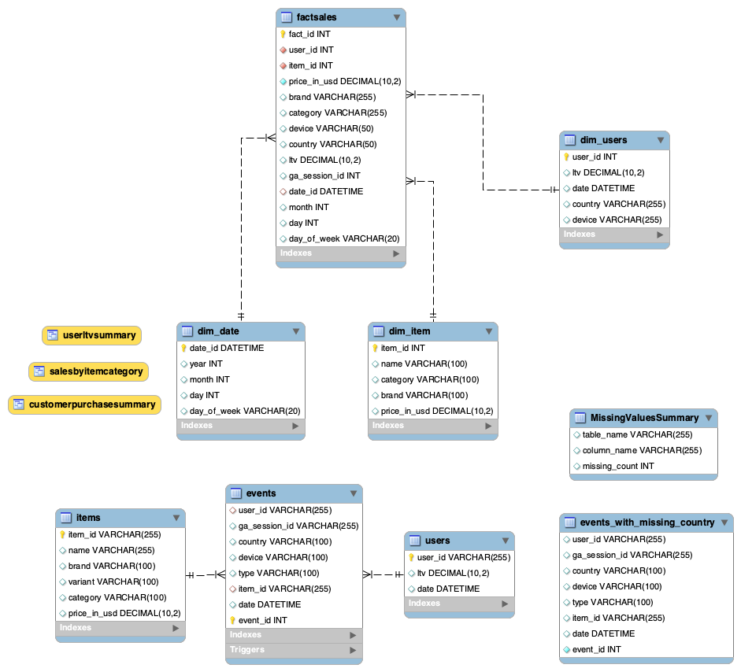

# data-engineering-term-project-1
This repository contains my work for the Data Engineering 1: SQL and Different Shapes of Data course. The Term Project 1 uses data from the Google Merchandise Store.

Project Title: Google Merchandise Store ETL and Analytics

# Table of Contents
1. [Project Overview](#project-overview)
2. [Data Source Details](#data-source-details)
3. [System Architecture](#system-architecture)
4. [Operational Data Layer](#operational-data-layer)
5. [Analytics Plan](#analytics-plan)
6. [Analytical Data Layer](#analytical-data-layer)
7. [ETL Pipeline Design](#etl-pipeline-design)
8. [Data Mart and Views](#data-mart-and-views)
9. [Conclusion and Future Work](#conclusion-and-future-work)

## Usage Instructions

1. **Clone the repository:**
   ```bash
   git clone https://github.com/ayazhantn/data-engineering-term-project-1


## Repository Structure

The repository is organized as follows:
- **`Term1/`**: Main project folder.
  - **`data/`**: Contains CSV files with raw data.
    - `events1.csv`: Data related to events.
    - `users.csv`: Data related to users.
    - `items.csv`: Data related to items.
  - **`script/`**: Contains SQL scripts used in the project.
    - `term-project-1.sql`: The SQL script for the project.
  - **`EER_TP1.png`**: EER.
  - **`factSales.png`**: Fact table - analytic.

- **`README.md`**: This file, which contains the documentation for the project.


# Project Overview

The goal of this project is to apply knowledge and skills learned during the Data Engineering 1: SQL and Different Shapes of Data course. The project involves building an ETL pipeline and analytics framework for the chosen Google Merchandise Store dataset to get insights about user behavior, sales trends, and data quality issues.

The project consists of the following components:
- Operational layer: operational data layer in MySQL, downloading the dataset.
- Data analytics plan: analytics to be executed on the data.
- Analytical layer: data structure in the form of MySQL table.
- ETL pipeline: extraction of raw data from CSV files (events, items, and users), transformation by cleaning and joining relevant columns, and loading the processed data into structured tables; usage of Triggers and Stored procedures.
- Data mart: Views as data marts.

# Data Source Details
Dataset: a subset of the anonymized Google Analytics event data for the Google Merchandise Store. The timeframe of the data: November 2020 – January 2021 (3 months). There are 3 files: events.csv, items.csv and users.csv, which contain information on purchase steps, items sold and users activity, respectively. The full dataset is available as a BigQuery Public Dataset: ga4_obfuscated_sample_ecommerce dataset.

Files:
  - events1.csv: Data on events, including user data, their activities such as adding to the cart, proceeding to checkout, purchasing, and others.
  - items.csv: Details on products, categories, and prices.
  - users.csv: Data on users, their lifetime value and the date of their first touch.

Source: Kaggle - Google Merchandise Store Dataset. This dataset is available as a BigQuery public dataset.

# System Architecture
The architecture of the project consists of the following components:
- Database: The relational database stores all the data to be analyzed. MySQL is used for both operational and analytical data layers.
- Data Flow:
  1. Operational Layer: Relational tables to store raw data.
  2. ETL Pipeline: Extract, Transform, and Load processes using stored procedures and triggers.
  3. Analytical Layer: Denormalized tables for fast querying and conducting analysis.
  4. Data Marts: Views and materialized views for analytics needs.


# Operational Data Layer
Objective: to store raw data in a relational structure that mirrors the original datasets.

Steps:
- Data Import:
events.csv, items.csv, and users.csv data files are imported into MySQL.

- Relational tables are created, foreign key relationships between tables are taken into consideration.

Tables:

events1.csv table contains information on user activities & sessions:
| Column        | Description                                                       |
|---------------|-------------------------------------------------------------------|
| user_id       | Unique identifier for the user.                                  |
| ga_session_id | Session ID for Google Analytics tracking.                        |
| country       | Country of the user.                                             |
| device        | Device type used (e.g., mobile, desktop).                        |
| type          | Type of action (e.g., "add to cart", "purchase").                |
| item_id       | ID of the item involved in the action.                           |
| date          | Timestamp of the action.                                         |


items.csv table contains details on each item including its:
| Column         | Description                                                       |
|----------------|-------------------------------------------------------------------|
| id             | Unique identifier for the item.                                  |
| name           | Name of the item.                                                |
| brand          | Brand associated with the item.                                  |
| variant        | Variant information (e.g., size, type or denotes if it has only one type/variant). |
| category       | Category to which the item belongs (e.g., Apparel, Drinkware).    |
| price_in_usd   | Price of the item in USD.                                        |


users.csv table has following data on users:
| Column | Description                          |
|--------|--------------------------------------|
| id     | Unique identifier for the user.     |
| ltv    | Life-time-value (in USD).           |
| date   | Date of first touch.                |


- Data Relationships:
The following foreign key relationships are set up:

`item_id` in `Events` and `Items`;

`user_id` in `Events` and `Users`.



# Analytics Plan
The strategy for analyzing the Google Merchandise Store dataset is set to extract actionable insights on user behavior, products popularity and revenue trends. This analytics plan, when implemented, can be used to improve marketing strategies and user experience by building on insights from the data analyses.

Customer Purchase Behavior:

This can be researched by Device and Country (which are available demographics data in the database).

  - Find the distribution of total revenue across different countries and devices;
  - Variance of the average purchase value by country and device;
  - Find the device type used mostly for generating the most revenue across different countries;
  - Number of sessions per user coming from a specific country or based on their device type.

This can be researched also considering the lifetime value (LTV) which is provided on each user.
  - Relationship between LTV and the total revenue generated by users in 3 months for which data is available;
  - High LTV users and the number of their sessions, frequency of their purchases;
  - Distribution of customer LTV across countries.

Sales Summary:
  - Product categories that generate the most revenue;
  - Products within each category that have highest sales volume;
  - Average price of products in the categories which are best-sold;
  - Trends in product sales across different times.

# Analytical Data Layer

- Tables:

Additional dimension tables: dim_date, dim_users, dim_item.

They capture user demographics, product details, and time-related data.

- Denormalized Data Structure:

FactSales combines information from events, items, and users.


# ETL Pipeline Design
The ETL pipeline involves following steps: 

- Extract:

MySQL queries to extract data from events1, items, and users csv files.

(Since I am using Load Data Infile command, I could not apply the stored procedure here.)

- Transform:

Use stored procedures to handle transformations.

- Load:

Load the transformed data into the FactSales table in the analytical layer.

# Data Mart and Views

This project creates and analyzes various views to summarize customer purchase behavior:

- **Customer Purchase Summary by Device and Country**: Helps understand user demographics and preferences, aiding in future marketing and targeting strategies.
- **Sales Summary by Item and Category**: Identifies popular products and price ranges, optimizing product performance for pricing and marketing strategies.
- **User Lifetime Value (LTV) Analysis**: Analyzes user purchase behavior to help with marketing and targeting strategies based on user value.


# Conclusion and Future Work

The project might be improved by adding more stored procedures as ETL pipeline, analysing more questions, adding more triggers.
